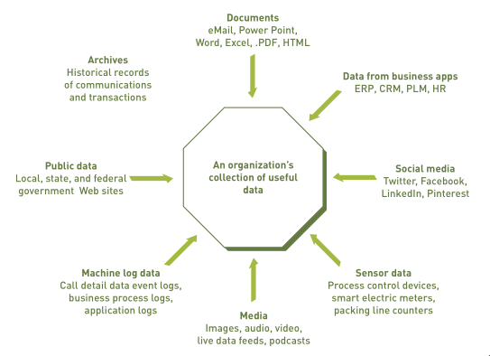

# Big Data

## Pengertian

Big Data adalah sebuah istilah yang digunakan untuk mendeskripsikan koleksi data yang berukuran sangat besar (dalam terabyte atau lebih) dan kompleks yang mana perangkat lunak manajemen data tradisional tidak mampu mengelolanya.

## Karakteristik dari Big Data

Adapun karakteristik dari suatu big data antara lain:

-   Volume: Suatu Big Data emiliki volume data yang sangat besar ( dalam terabyte atau lebih).
-   Velocity: Kecepatan menerima dan mengirim data pada big data adalah hal yang sangat penting untuk diperhatikan. Rata-rata kecepatan suatu big data dalam menerima dan mengirim data adalah sekitar 5 miliar bit/detik.
-   Variety: Terdapat berbagai macam varietas (jenis) data yang simpan pada suatu big data. Terdapat dua jenis data: data yang terstruktur (structured data), contohnya data berjenis plain teks dan data yang tidak terstruktur (unstructured data), contohnya dokumen, email, foto, pesan sms dan lain sebagainya.

## Sumber pada Big Data

Biasanya perusahaan-perusahaan besar yang menggunakan big data mendapatkan data dari berbagai sumber seperti aplikasi bisnis, sosial media, mesin-mesin controller pada gedung, dokumen, data publik dan lain sebagainya.

Beberapa portal yang memberikan akses big data secara gratis antara lain:

-   Amazon Web Services
-   Facebook Graph
-   Google Finance
-   Kemendikbud
-   Kemenkes

## Penerapan Big Data

Berikut beberapa contoh bagaimana sebuah organisasi menerapkan big data untuk meningkatkan kegiatan sehari-hari, perencanaan dan pengambilan keputusan:

-   Perusahaan media sosial seperti Facebook, Google Twitter dan yang lainnya menggunakan big data yang didapat dari postingan para pengguna sosial media untuk dianalisis dengan harapan meningkatkan profit ataupun value dari perusahaan.
-   Rumah sakit menerapkan big data, yakni menganalisis data medis dan catatan pasien (patient records) untuk mengidentifikasi dalam pengambilan keputusan terhadap apa yang akan dilakukan pada pasien.
-   Pemerintah yang memberikan akses big data seperti data penduduk (tentunya tidak semua data, khususny yang bersifat personal) sehingga dapat digunakan oleh pengembang aplikasi dalam mengembangkan aplikasinya.

## Tantangan pada Big Data

Banyak terdapat tantangan dalam penggunaan Big Data seperti misalnya menangani data yang begitu banyak dan sangat bervariasi, memproses data seperti menyimpan data, menganalisisnya dan masih banyak yang lainnya.
Beberapa tantangan itu antara lain:

-   Kurangnya tenaga kerja profesional 
    Untuk menjalankan teknologi modern seperti Big Data, sebuah perusahaan memerlukan seorang yang benar-benar ahli dalam bidang ini. Permasalahannya adalah hanya ada sedikit yang benar-benar ahli pada bidang ini dikarenakan teknologi untuk Big Data cepat sekali berkembang.
-   Perkembangan Data 
    Salah satu permasalahan yang dihadapi pada Big Data adalah perkembangan data yang begitu masif, berkembang secara eksponensial. Semakin berkembangnya data, semakin sulit pula dalam menanganinya, apalagi dalam menangani data yang tidak terstruktur (foto, video) yang notabene berukuran cukup besar sehingga akan dengan cepat menghabiskan storage dengan cepat.
-   Keamanan Data 
    Dengan begitu banyaknya data yang ada, mengamankan data tersebut adalah sesuatu hal yang sangat perlu diperhatikan. Beberapa perusahaan memperkerjakan cybersecurity untuk mengamankan data mereka.

Sumber tulisan:

-   [Principle of Information Systems: Ralph M. Star & George W. Reynolds](https://www.amazon.com/Principles-Information-Systems-Ralph-Stair/dp/1305971779)
-   [Big Data Challenges - XenoStack](https://www.xenonstack.com/insights/big-data-challenges)
