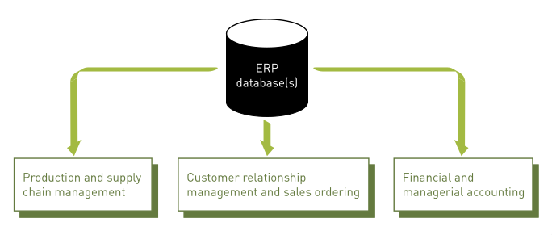

# Tugas 5 Sistem Informasi Pendidikan

## Enterprise System

_Enterprise System_ adalah sebuah sistem terpusat pada suatu organisasi yang memastikan informasi pada organisasi tersebut dapat dibagikan diantara pengguna yang terotorisasi terhadap seluruh fungsi bisnis dan pada semua tingkatan manajemen untuk mendukung jalannya suatu bisnis.

Bisnis-bisnis bergantung kepada _enterprise system_ untuk melakukan berbagai kegiatan bisnis harian mereka seperti memproduksi _supply_, distribusi _supply_, penjualan, marketing, HR, manufaktur, akunting, perpajakan agar kegiatan bisnis harian tersebut dapat dikerjakan lebih cepat tanpa pemborosan ataupun kesalahan.

Tanpa adanya sistem seperti di atas, pencatatan dan pemrosesan transaksi bisnis akan memakan banyak sumber daya dari suatu organisasi.

## Tujuan Enterprise System

Tujuan utama dari penerapan _Enterprise System_ adalah untuk memuaskan pelanggan dan menyediakan benefit yang signifikan dengan mengurangi biaya dan meningkatkan layanan.

## Enterprise Resource Planning (ERP)

_Enterprise resource planning_ (ERP) adalah sekumpulan program terintegrasi yang memanajemen operasi bisnis utama perusahaan untuk keseluruhan perusahaan, bahkan yang perusahaan komples, _multisite_ ataupun organisasi global.

Sistem ERP berkembang dari sistem MRP (_Materials Requirement Planning_) yang dikembangkan di tahun 1970-an. Sistem ini menggabungkan perencanaan produksi, kontrol inventaris, pembelian fungsi bisnis untuk organisasi manufaktur.

## Kelebihan dari ERP

Adapun kelebihan dari sistem ERP antara lain :

- Meningkatkan kompetensi global.
- Menyediakan _software_ terintegrasi untuk membantu proses bisnis.
- Meningkatkan akses pada data yang berkualitas untuk digunakan dalam pengambilan keputusan.
- Mengurangi biaya proses bisnis yang mahal.
- Meningkatkan proses bisnis yang berjalan.
- Memberikan kesempatan untuk meningkatkan dan menstandarisasi teknologi infrastruktur.
- Menyediakan solusi efektif untuk segmen industri dan market yang spesifik.

## Implementasi ERP

ERP dapat diterapkan pada proses bisnis Usaha Kecil dan Menengah (UKM) di Indonesia dengan menggunakan suatu aplikasi ERP dengan tujuan untuk menginterasi dan mengotomisasi proses bisnis pada UKM.

Semakin ketatnya kompetisi antara UKM dan perusahaan besar, UKM harus mencari keunggulan kompetitif yang dapat membantu mereka dalam meminimalkan biaya dan memaksimalkan keuntungan. Salah satu isu utama yang dihadapi oleh UKM adalah terbatasnya sumber daya dan kemampuan finansial yang dimiliki. Sel ain itu, sebagian besar dari proses bisnis yang dimiliki oleh UKM masih dilakukan secara manual.

Aplikasi ERP dapat menjadi salah satu solusi untuk membantu UKM dalam menyederhanakan, mengintegrasikan dan mengotomatisasi proses bisnis mereka.

Beberapa contoh aplikasi ERP antar lain :

- NetSuite ERP
- Rossum
- Scoro
- OpenBravo
- OpenERP
- dll

Dengan kata lain, aplikasi ERP dapat memudahkan dan memfasilitasi interaksi yang kuat antara bagian produksi, penjualan, keuangan dan pemasaran di mana setiap orang dapat berada dalam satu halaman yang sama.

Selanjutnya, dengan menggunakan aplikasi ERP, UKM terbantu dalam perkembangan akan pemahaman atas bagaimana proses bisnis yang berbeda-beda dapat diintegrasikan dan berdampak satu sama lain pada proses-proses tersebut.

## Daftar Pustaka

[Artikel Riset ERP dengan Fokus pada UKM](https://jsi.cs.ui.ac.id/index.php/jsi/article/view/287/112)
