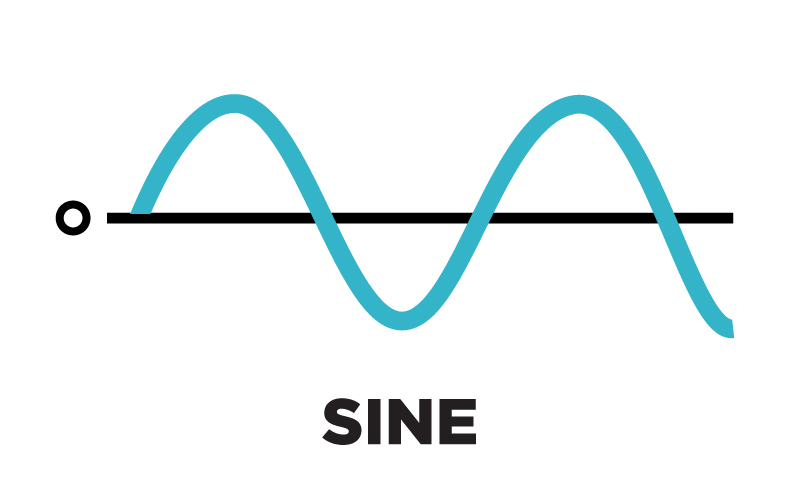
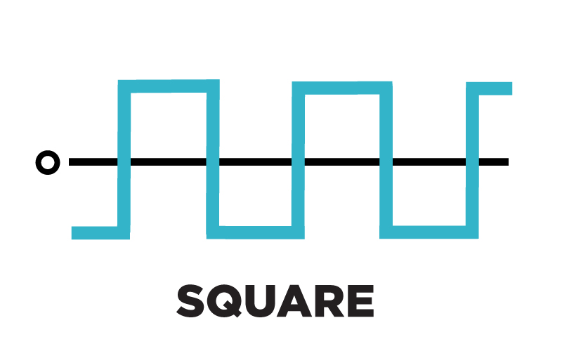

# Script Tugas Media & Teknologi Pembelajaran

## Salam Pembuka

Ucapkan salam dan perkenalkan nama...

## Pendahuluan

Kalian pasti sering mendengar musik kan? Coba kalian dengarkan musik berikut ini...

> Putar musik...

Nah, jika kita perhatikan dengan seksama, kira-kira darimana asal suara dari musik tersebut? Musik tersebut dihasilkan bukan dari alat musik asli, melainkan musik digital yang dihasilkan menggunakan teknologi audio digital.

**Audio digital** adalah teknologi yang digunakan untuk merekam, menyimpan, memanipulasi, menghasilkan, dan mereproduksi suara dengan menggunakan sinyal audio yang telah dikodekan dalam bentuk digital.

## Jenis Audio Digital

Suara pada audio digital dihasilkan dengan menggabungkan 3 bentuk gelombang suara dasar yang terdapat pada audio digital sebagai berikut.

### Gelombang Sinus

Gelombang Sinus atau _Sine Waveform_ atau juga disebut dengan _Sinusoida Waveform_ adalah salah satu bentuk gelombang yang paling umum digunakan pada pengolahan audio digital yang memiliki frekuensi yang rendah dan memiliki suara yang lembut dan bersih sehinga sering digunakan untuk suara bas, _pad_ ataupun suara bertipe _low_ lainnya.

> Berikan contohnya!

### Gelombang Square

Gelombang Square adalah salah satu bentuk gelombang suara pada audio digital yang memiliki ciri khas gelombangnya berbentuk kotak yang diakibatkan karena gelombang ini memiliki _harmonics_. Suara yang dihasilkan bersifat agresif dan bising.

> Berikan contohnya!

### Gelombang Saw

Mirip seperti gelombang square, gelombang saw memiliki _harmonics_ namun dengan tingkatan yang berbeda sehingga bunyi yang dihasilkan pun berbeda pula. Bentuk dari gelombang ini mirip seperti ujung gergaji. Suara yang dihasilkan bersifat agresif dan lebih bising dibandingkan dengan square sehingga kadang biasanya digunakan untuk menjadi suara _lead_ melodi untuk suatu musik.

> Berikan contohnya!

## Efek pada Pengolahan Audio

Tadi kita sudah mengetahui bahwa musik-musik modern yang sering kita didengarkan ternyata dihasilkan dengan menggunakan teknologi audio digital dan kita juga sudah membahas beberapa tipe gelombang suara dasar digital yang dijadikan sebagai dasar dalam pembuatan musik digital.

Jika kita dengarkan kembali suara gelombang tadi, tentunya sangat tidak menarik dan tidak nyaman untuk didengar. Oleh karena itu diperlukan pemberian efek pada suara tersebut agar dapat menghasilkan suara yang nyaman untuk didengar. Pemberian efek pada suara atau audio disebut sebagai manipulasi audio.

Beberapa efek yang digunakan untuk memanipulasi audio antara lain sebagai berikut.

### Delays dan Echoes

Efek _Delays_ dan _Echoes_ adalah efek yang di gunakan untuk membuat keterlambatan atau penundaan suara seperti gema. Efek ini juga biasa di sebut dengan efek pantul, seperti yang terdengar ketika kita berteriak di ruang yang tertutup, atau di pegunungan.Semakin kecil ruangannya maka semakin cepat terdengar pantulannya, semakin besar ruangannya semakin lambat kita mendengar pantulan.

> Berikan contohnya sebelum dan sesudah diberi efek

### Filter

Efek Filter digunakan untuk mengeliminasi rentang frekuensi dari audio dengan menggunakan _equalizer_. Dengan efek ini, kita bisa menambahkan atau mengurangi tingkat frekuensi tinggi , frekuensi sedang dan frekuensi rendah. Biasanya digunakan untuk menghindari tubrukan frekuensi yang bisa menyebabkan suara tidak keluar sempurna.

> Berikan contohnya sebelum dan sesudah diberi efek

### Reverb

Efek _reverb_ digunakan untuk menghasilkan efek suara seperti seolah kita sedang berada di ruang tertutup seperti aula atau lainnya sehingga terdapat suara gema yang memantul. Efek _reverb_ ini sering dikombinasikan dengan efek _delay_ sehingga menghasilkan audio yang lebih kaya dan tidak _dry_ atau kering.

> Berikan contohnya sebelum dan sesudah diberi efek

### Flanger

Efek _flanger_ digunakan untuk menciptakan efek yang sama seperti efek _delay_ namun perbedaannya adalah efek _flanger_ akan membuat dua suara yang diputar bersama-sama namun salah satunya diputar agak lambat sehingga menghasilkan efek suara yang keluar masuk.

> Berikan contohnya sebelum dan sesudah diberi efek

## Penutup

Improvisasi...
