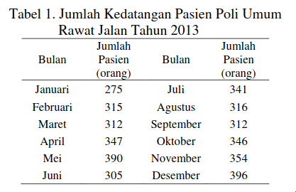
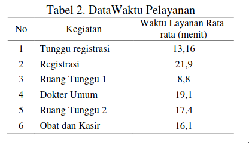

# Script Tugas Pembuatan Video Simulasi & Pemodelan

## Deskripsi

Anggota Kelompok :

- Ahmad Yogi (1910131210011)
- Cahya Kamila Maulida (1910131220013)
- Muhammad Heru Abdullah (1910131210009)

Studi Kasus : Simulasi untuk Optimasi Sistem Antrian Poli Umum Rawat Jalan Rumah Sakit X

## Latar Belakang Studi Kasus

Layanan merupakan indikator utama dalam keberhasilan usaha. Kualitas layanan industri jasa merupakan faktor utama yang harus diperhatikan dalam mempertahankan keberadaan dan persaingan industri jasa, tidak terkecuali industri jasa rumah sakit.

Rumah sakit merupakan industri jasa yang perkembangannya cukup pesat di Indonesia. Dirjen Bina Upaya Kesehatan Kemenkes Akmal Taher pada tahun 2014 menyatakan bahwa pertumbuhan industri jasa rumah sakit swasta adalah 5-10%.

Kualitas layanan di rumah sakit dapat mencakup berbagai aspek, seperti :

- Layanan antrian
- Layanan dokter dan konsultasi
- Layanan kebersihan
- Layanan kesediaan obat dan alat kesehatan

Layanan antrian merupakan salah satu layanan yang menjadi perhatian pasien. Oleh sebab itu, kualitas layanan terhadap sistem antrian di rumah sakit menjadi suatu hal yang menarik untuk diteliti. Kualitas suatu rumah sakit selain ditentukan oleh tingkat keahlian dokter yang dimiliki, sarana dan prasarana pendukung yang berkualitas, juga ditentukan oleh sistem antrian yang terjadi di dalam rumah sakit tersebut. Jika tingkat kedatangan dan tingkat pelayanan yang diberikan kepada pasien tidak seimbang. maka akan menyebabkan ketidakpuasaan bagi pasien dan kerugian bagi rumah sakit karena pasien cenderung beralih ke rumah sakit yang memiliki tingkat pelayanan yang lebih optimal.

## Permasalahan yang Ingin Diselesaikan dengan Pemodelan dan Simulasi

Berdasarkan deskripsi di atas, agar dapat mengoptimalkan proses antrian yang terjadi pada rumah sakit, dapat dilakukan sebuah simulasi. Simulasi dilakukan untuk mengukur tingkat optimilitas sistem antrian yang sedang berlaku dan untuk mendapatkan sistem antrian yang optimal.

Adapun rumah sakit yang akan dijadikan sebagai sumber data untuk simulasi ini adalah Rumah Sakit X (RSX). Rumah Sakit X merupakan salah satu rumah sakit ternama di kota Depok yang memiliki 21 poli yang aktif melayani pasien setiap hari.

Simulasi dilakukan di poli umum karena poli ini memiliki tingkat kedatangan yang konstan setiap harinya dengan rata-rata kedatangan dan pasien yang terlayani setiap bulannya adalah 335 pasien. Maka dari itu perlu dilakukan simulasi untuk mengoptimalkan proses antrian pada poli umum di RSX.

## Tujuan Pemodelan dan Simulasi terhadap Studi Kasus

Simulasi ini dilakukan untuk mengukur tingkat optimalitas sistem antrian yang berlaku saat ini di RSX. Pengukuran dititikberatkan pada waktu layanan, jumlah pasien yang terlayani dan waktu tunggu pasien hingga terlayani dalam sistem antrian.

Adapun tujuan khusus dari penelitian ini adalah :

- Menentukan jumlah optimum pasien yang dapat dilayani oleh dokter umum di antrian poli umum.
- Lamanya waktu tunggu yang harus dilalui pasien pada antrian rawat jalan di RSX.

Hasil pengukuran tingkat optimalitas sistem antrian saat ini dibandingkan dengan usulan sistem antrian agar tingkat kepuasan pasien selaku pelanggan terpenuhi. Sistem antrian usulan diperoleh melalui pendekatan simulasi, dengan bantuan **_software_ FlexSim**.

Hasil simulasi diharapkan dapat membantu pihak manajemen rumah sakit dalam mengetahui tingkat _performance_ karyawan dan dokter di rumah sakit. Selain itu, diharapkan dapat membantu pihak manajemen untuk mengambil strategi yang tepat dalam melakukan penambahan karyawan atau dokter yang sesuai dengan kondisi yang ada di rumah sakit.

## Detail Tahapan Pemodelan dan Simulasi

Simulasi ini diawali dengan identifikasi sistem antrian yang saat ini sedang berlaku pada kegiatan dokter umum di Poli Umum pada RSX. Kemudian dilanjutkan dengan melakukan observasi terhadap waktu layanan dan jumlah pasien yang dilayani, serta waktu tunggu yang terjadi di dokter poli umum. Berdasarkan hasil observasi dan interview dengan pihak menajamen, diketahui bahwa saat ini diperkirakan dalam satu jam seorang dokter umum dapat melayani 4 hingga 6 pasien. Pada simulasi ini dinyatakan bahwa semua pasien yang datang melakukan layanan mulai dari registrasi hingga pengambilan obat ke apotek RSX.

Adapun alur sistem antrian yang terjadi pada Poli Umum di RSX adalah :

1. Terjadi kedatangan pasien untuk siap masuk dalam sistem antrian di meja registrasi, yang akan diterima oleh petugas administrasi. Kegiatan yang terjadi adalah pasien mendaftarkan nama dan kepemilikan asuransi. Petugas akan mencatat rekam medik pasien, jika pasien adalah pasien yang pernah terdaftar, dan membuat status rekam medik baru karena pasien adalah pasien yang pertama kali terdaftar di RSX. Petugas juga akan mencatat poli dan dokter yang dipilih pasien akan dikunjungi.
2. Pasien sudah masuk dalam sistem antrian, dan berada pada ruang tunggu poli umum. Pasien menunggu untuk dilayani oleh dokter umum.
3. Pasien masuk dalam pelayanan dokter. Pasien akan diterima oleh dokter untuk mengkonsultasikan keluhannya. Kemudian pasien akan ditindak oleh perawat, untuk ditimbang, diukur tinggi, diukur suhu dan diukur tekanan darah. Setelah itu, konsultasi kembali dilakukan, dan dokter akan memberikan resep, serta penjelasan untuk penggunaan resep bagi pasien.
4. Setelah pasien dilayani dokter, maka pasien akan masuk dalam antrian pembelian obat di apotek. Pada pos ini, pasien akan menunggu.
5. Pasien akan dilayani untuk pembayaran dan pengambilan obat sesuai resep.

Adapun input data yang dimasukan kedalam entitas terdiri dari waktu proses atau siklus setiap stasiun (dalam hal ini pos layanan) dan waktu operasional pelayanan dokter dalam sehari.

Pada simulasi ini, waktu proses atau pelayanan setiap stasiun kerja secara detail disajikan pada tabel berikut :

## Hasil Pemodelan dan Simulasi

## Kesimpulan

Jumlah optimum pasien yang dapat dilayani dalam 1 hari adalah 16 pasien, dengan kondisi 1 orang pasien tidak dapat terlayani. Oleh sebab itu, dinyatakan bahwa terdapat 17 pasien yang masuk dalam sistem antrian poli umum rawat jalan. Sistem antrian yang terjadi adalah pasien masuk dalam sistem antrian diawali di bagian registrasi, ruang tunggu dokter, dilayani dokter umum, apotek, ruang tunggu, menerima obat dan meninggalkan sistem antrian. Lamanya waktu tunggu untuk sistem antrian ini adalah 107,18 menit atau selama 1,78 jam.

## Daftar Pustaka

[Simulasi untuk Optimasi Sistem Antrian Poli Umum Rawat Jalan Rumah Sakit X](http://digilib.mercubuana.ac.id/manager/t!@file_artikel_abstrak/Isi_Artikel_809851305023.pdf)
